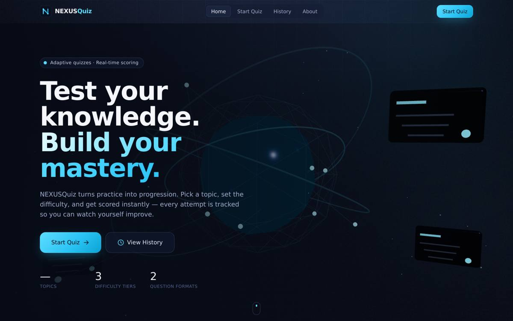
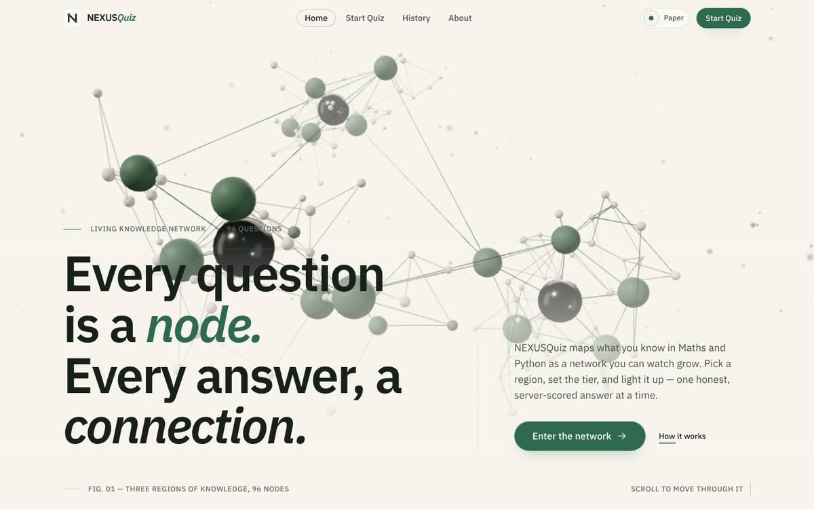

# NEXUSQuiz

**Test your knowledge. Build your mastery.**

A premium quiz platform for Maths and Python, powered by the original Python quiz engine.

```
quiz.app/        ← Python quiz engine (UNCHANGED — source of truth)
  quiz.py          question bank, randomisation, scoring, history
  questions.json   real question data
  history.json     every attempt ever taken
api/server.py    ← thin Flask adapter that exposes the engine over HTTP
src/             ← React + Vite + Tailwind + Framer Motion + Three.js frontend
```


## What it looks like (rendered screenshots)

Real headless-Chromium captures of the built app, in `docs/screenshots/`:

| Before (original build) | Now — Home, Paper theme |
| --- | --- |
|  |  |

More: [Home scrolled](docs/screenshots/02-home-scrolled.jpg) · [Setup](docs/screenshots/03-setup.jpg) · [Quiz](docs/screenshots/04-quiz.jpg) · [Result](docs/screenshots/05-result.jpg) · [History](docs/screenshots/06-history.jpg) · [About](docs/screenshots/07-about.jpg) · [Ink (dark) theme](docs/screenshots/08-ink-theme.jpg) · [Mobile](docs/screenshots/09-mobile-home.jpg)

> If your local copy still looks like the "before" image, you are running an old build: delete the old folder, re-download the ZIP, run `start.bat` again and press **Ctrl+F5** in the browser.

## Run it (one command)

Requires **Python 3.10+** and **Node.js 18+**.

| Windows | macOS / Linux |
| --- | --- |
| double-click **`start.bat`** | `./start.sh` |

Then open **http://localhost:5000** — that single server hosts both the website and the API.

<details>
<summary>Manual / development mode (hot reload)</summary>

```bash
pip install -r requirements.txt
python3 api/server.py            # API on http://localhost:5000

npm install
npm run dev                      # UI on http://localhost:5173 (proxies /api → :5000)
```
</details>

## API (adapter over the engine)

| Method | Path                | Notes                                                  |
| ------ | ------------------- | ------------------------------------------------------ |
| GET    | `/api/categories`   | Real categories + per-difficulty counts                |
| POST   | `/api/quiz/start`   | `{category, difficulty, count}` → session + questions **without answers** |
| POST   | `/api/quiz/submit`  | `{session_id, answers[]}` → scored by `quiz.py`, saved to `history.json` |
| GET    | `/api/history`      | Contents of `history.json`                             |

Scoring, answer validation, marks and randomisation all come from `quiz.py`.
Sessions are single-use and expire; correct answers never reach the browser before submission.

## Visual system & themes

All colours come from design tokens in `src/styles/tokens.css` (no hex values in components).
Two complete themes ship — **Paper** (default; warm ivory + ink + vermilion) and **Ink** (deep
charcoal + bone + ember) — switchable from the header; the choice is remembered in `localStorage`
and the system preference is respected on first visit. The light default is evidence-based
(positive-polarity reading research); see [`docs/DESIGN-SYSTEM.md`](docs/DESIGN-SYSTEM.md) for
the research, the 3D reference review, the token contract and the motion system.

### The Living Knowledge Network (3D identity)

One persistent WebGL scene lives in a single canvas under every page. Three regions of knowledge
(Maths · Python · Mixed) sit at different depths, each with a dark core, a ring of topic nodes and a
cloud of question nodes joined by hairline links. Signals travel outward from the cores; optional
links relink slowly so the network rearranges instead of spinning; depth fog dissolves the far
regions into the paper. The page decides how it behaves:

| Page    | State       | What drives it                                                        |
| ------- | ----------- | --------------------------------------------------------------------- |
| Home    | alive       | scroll dollies the camera in; cursor repels nearby nodes; hover labels a node |
| Setup   | responsive  | region → camera and focus move there; tier → link density; size → activation |
| Quiz    | quiet       | recedes into the fog at half update rate; one soft signal per question |
| Result  | activated   | camera pulls back from a core while the score lights the network outward |
| History | accumulated | each region is "established" from real attempts there, weighted by accuracy |
| About   | atmospheric | museum-slow, off to the side                                           |

Quality tiers (high / medium / low) come from device signals and a frame-rate monitor steps the
resolution down under load; devices without WebGL or with `prefers-reduced-motion` get a static
SVG network instead. The canvas is `pointer-events: none`, so it can never block a tap.
